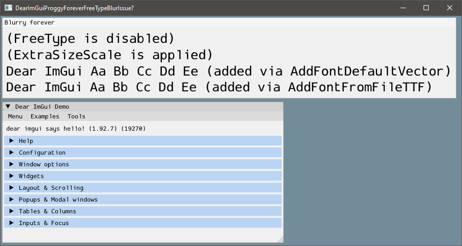
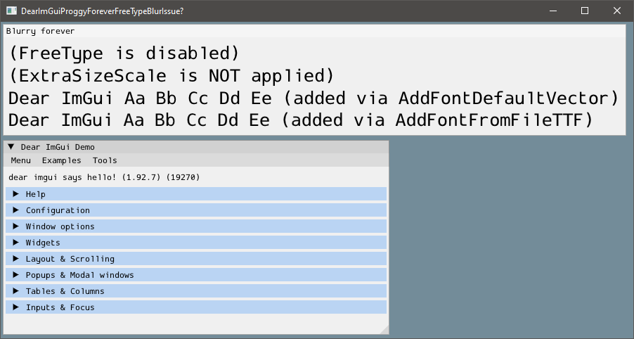
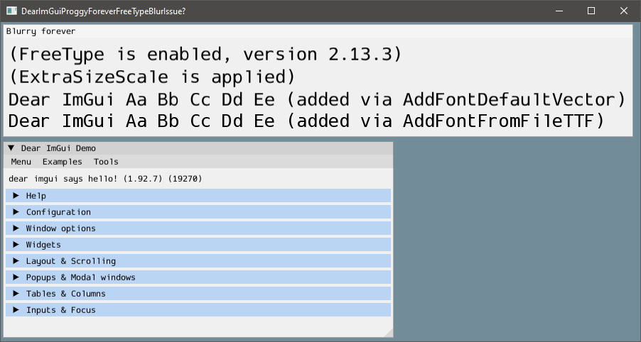
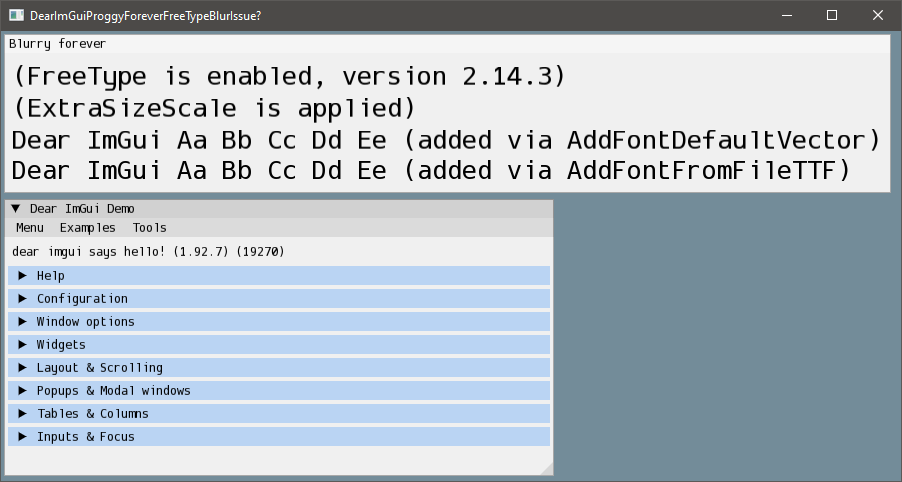
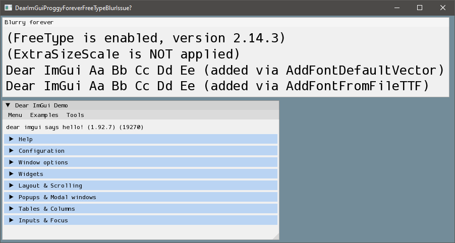

# Dear ImGui's `AddFontDefaultVector` + FreeType observations

While trying out the new font in Dear ImGui, the ProggyForever, I found out that there is a difference in how the text looks depending on whether you import it using a `AddFontDefaultVector` or get the TTF file and use a `AddFontFromFileTTF`. Specifically, using `AddFontDefaultVector` makes the text blurry.

Later, I found out this is an issue only when using FreeType. And the behavior varies depending on the version of FreeType used.

When using `AddFontDefaultVector` and FreeType, the text looks more blurry, especially in version 2.13.3. What makes the most difference is probably this line:

```cpp
font_cfg.ExtraSizeScale *= 1.015f; // Match ProggyClean
```

So I tried disabling this line and comparing the results (visually), results are below.

## Packages used

Dependency|Version|Licence
---|---|---
Dear ImGui|1.92.7|[MIT](./Dependency/imgui/imgui-1.92.7/LICENSE.txt)
GLFW|3.4|[zlib](./Dependency/glfw-3.4/LICENSE.md)
Glad|2.0.8|[MIT](https://github.com/Dav1dde/glad/blob/glad2/LICENSE)
FreeType|2.13.3 (latest on vcpkg right now)|[Custom](./Dependency/freetype-VER-2-13-3/docs/FTL.TXT)
FreeType|2.14.3 (latest release right now)|[Custom](./Dependency/freetype-VER-2-14-3/docs/FTL.TXT)
ProggyForever||[MIT](https://github.com/ocornut/proggyforever/blob/master/LICENSE.txt)

## Results

### Dear ImGui 1.92.7 without FreeType

Text looks OK without FreeType. The `ExtraSizeScale` just makes it a bit bigger, which is expected.





### Dear ImGui 1.92.7 with FreeType 2.13.3

This is the version of FreeType you get when using _vcpkg_ (as the time of writing).

The text blurry, but if we disable `ExtraSizeScale`, it looks OK again!

Last line in the upper window is the only line that is using the font from the TTF file instead of using `AddFontDefaultVector`. It looks great on both screenshots!

You can see this best when you switch between the two images. You can open them in separate tabs and use <kbd>Ctrl</kbd>+(<kbd>Shift</kbd>)+<kbd>Tab</kbd>.

* Also notice:
  * Cutoff on the letter _G_ in the upper window
  * Readability of the text in the demo window (e.g. _dear imgui says hello_)




### Dear ImGui 1.92.7 with FreeType 2.14.3

This is the latest release of FreeType as the time of writing.

The text is little less blurry, but still not ideal. Disabling `ExtraSizeScale` makes it clean again.

Last line in the upper window is the only line that is using the font from the TTF file instead of using `AddFontDefaultVector`. It looks great on both screenshots!

* Also notice in the demo window:
  * Height of all the letters
  * The _Tools_ main menu button, position of the letter _T_
  * The kerning on the letter _m_ (e.g. _ImGui_, _Examples_, _Columns_) (this does not change on the screenshots)





## Details

Version/Branch of Dear ImGui:

```text
Version 1.92.7, downloaded from the GitHub release tag v1.92.7
```

Back-ends:

```text
imgui_impl_opengl3.cpp + imgui_impl_glfw.cpp
```

Compiler, OS:

```text
Windows 10 + MinGW, also tested on MSVC
```

Full config/build information:

```cpp
Dear ImGui 1.92.7 (19270)
--------------------------------
sizeof(size_t): 8, sizeof(ImDrawIdx): 2, sizeof(ImDrawVert): 20
define: __cplusplus=202002
define: _WIN32
define: _WIN64
define: __MINGW32__
define: __MINGW64__
define: __GNUC__=13
IM_ASSERT: runs expression: OK. expand size: OK
--------------------------------
io.BackendPlatformName: imgui_impl_glfw (3400)
io.BackendRendererName: imgui_impl_opengl3
io.ConfigFlags: 0x00000003
 NavEnableKeyboard
 NavEnableGamepad
io.ConfigNavCaptureKeyboard
io.ConfigInputTextCursorBlink
io.ConfigWindowsResizeFromEdges
io.ConfigMemoryCompactTimer = 60.0
io.BackendFlags: 0x0000001E
 HasMouseCursors
 HasSetMousePos
 RendererHasVtxOffset
 RendererHasTextures
--------------------------------
io.Fonts: 2 fonts, Flags: 0x00000000, TexSize: 512,128
io.Fonts->FontLoaderName: FreeType
io.DisplaySize: 900.00,823.00
io.DisplayFramebufferScale: 1.00,1.00
--------------------------------
style.WindowPadding: 8.00,8.00
style.WindowBorderSize: 1.00
style.FramePadding: 4.00,3.00
style.FrameRounding: 0.00
style.FrameBorderSize: 0.00
style.ItemSpacing: 8.00,4.00
style.ItemInnerSpacing: 4.00,4.00
```
